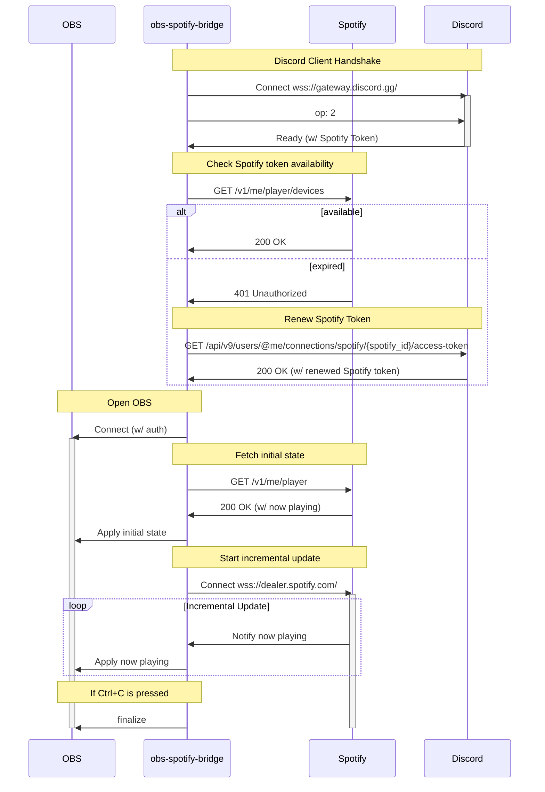

# OBS Spotify Bridge
This software bridges OBS and Spotify using Discord tokens.

<video style="max-width: 80%" autoplay loop src=https://user-images.githubusercontent.com/11992915/219961789-1d20114a-4d28-4ff6-bd93-f7e7d155fa38.mp4></video>

### Discriminer

I'm not a professional of Discord ToS and Spotify ToS, and it may lead to your account being banned.
This software is provided without any warranty and it is ***as-is***.

### Why does this require a Discord token?

Spotify tokens rotate and expire in a very short time.

But Discord tokens are valid for a long time,
and we can use them to get valid Spotify tokens.

## Download

https://github.com/yanorei32/obs-spotify-bridge/releases/tag/latest

## How to

### Step 0. Connect Discord account to the Spotify account

This software depends on Discord / Spotify account linking.
You must link those accounts before using this software.

Reference: [Discord Spotify Connection – Discord](https://support.discord.com/hc/en-us/articles/360000167212-Discord-Spotify-Connection)


### Step 1. Get Discord's user token by Discord Client
1. Login to [the web client](https://discord.com/login).
1. Paste this code to the Browser Console.
   [javascript - Any way to get my discord token from Browser Dev Console? - Stack Overflow](https://stackoverflow.com/questions/67348339)
   ```javascript
   (webpackChunkdiscord_app.push([[''],{},e=>{m=[];for(let c in e.c)m.push(e.c[c])}]),m).find(m=>m?.exports?.default?.getToken!==void 0).exports.default.getToken()
   ```
1. A token like this is displayed. `"ush9Zohzie6ahmohsoo6meCh.IThah7.jeephaijiachu8kuWoh0aephe5e"`

### Step 2. Create OBS sources

1. Create a `obs-spotify.text` as `TextSource`.
1. Create a `obs-spotify.albumart` as `BrowserSource`.
   1. Set size to square (likes 256x256).
   1. Set CSS
      ```css
      body {
        width: 100%;
        margin: 0;
        overflow: hidden;
      }
      * {
        background-color: rgba(0, 0, 0, 0) !important;
        color: rgba(0, 0, 0, 0) !important;
      }
      @keyframes rotate {
        from { transform: rotate(0turn); }
        to { transform: rotate(1turn); }
      }
      img {
        margin-top: calc((100vh - min(100vh, 100vw)) / 2);
        margin-left: calc((100vw - min(100vh, 100vw)) / 2);
        animation: rotate linear infinite calc(60s/33.5*2);
        border-radius: 50%;
        width: min(100vh, 100vw);
        height: min(100vh, 100vw);
        object-fit: contain;
        display: inline;
      }
      ```

#### NOTE
If `obs-spotify.text` and/or `obs-spotify.albumart` names conflict
or the naming convention is mismatched with others, you can use that as the suffix. (like `[TLP] obs-spotify.text`)

### Step 3. Configure obs-websocket

1. Open OBS
1. Navigate `Tools` -> `obs-websocket Settings`.
1. Check the `Enable WebSocket server`
1. Configure the `Server Settings`
1. Click the `Show Connect Info`
    - remember `Server IP`, `Server Port` and `Server Password` (if password is enabled).

### Step 4. Create a bat file

Create a bat file and place it in same folder.

```bat
@echo off

REM Please remove this set line if OBS authentication is disabled.
set OBS_PASSWORD=PLACE_YOUR_OBS_PASSWORD
set DISCORD_TOKEN=PLACE_YOUR_DISCORD_TOKEN

obs-spotify-bridge

IF %ERRORLEVEL% NEQ 0 (
    echo.
    echo ---- ERROR OCCURRED ----
    echo Please READ the backtrace.
    echo.
    pause
)
```
#### NOTE

If you run OBS at a non-default port or different host,
additional settings are required.

```bat
set OBS_ADDRESS=127.0.0.1
set OBS_PORT=4455
```

### Step 5. Double click the bat file.
You can use it now!
If you need a additional support,
you can create an issue or send a DM to @yanorei32.

## How it works


